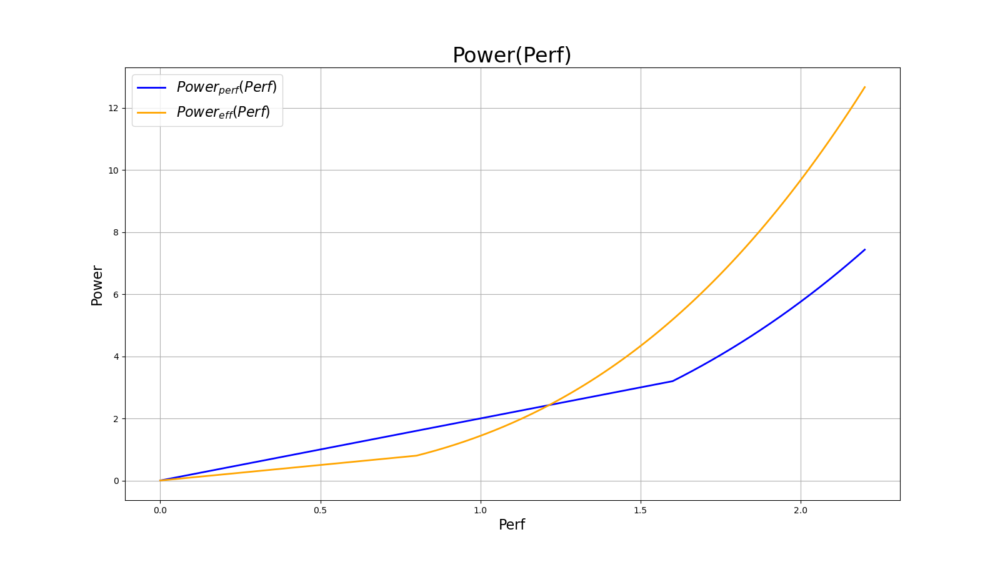
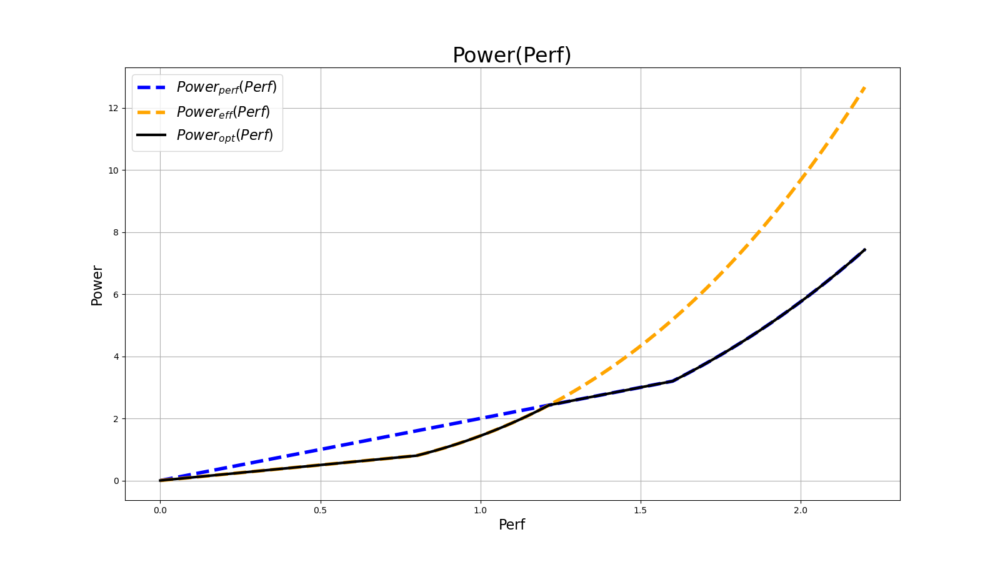
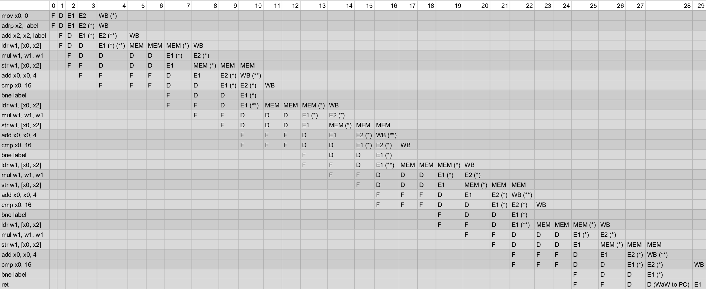
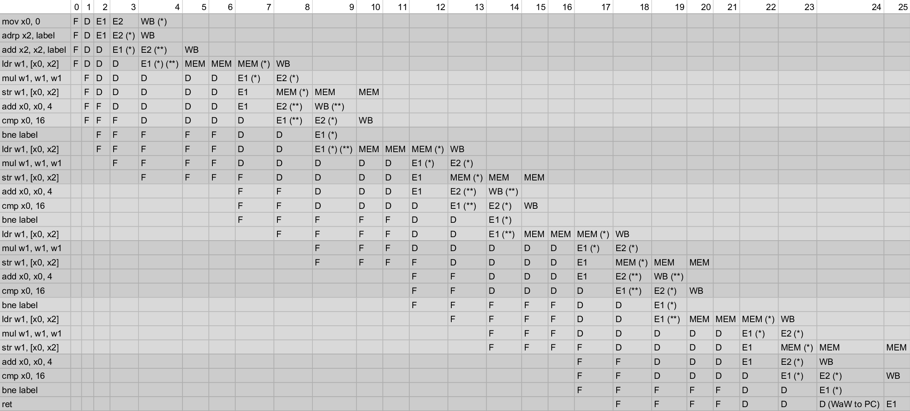
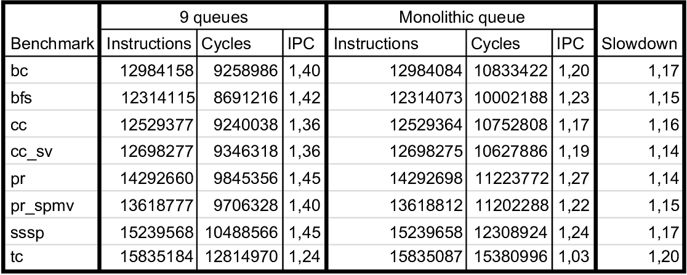
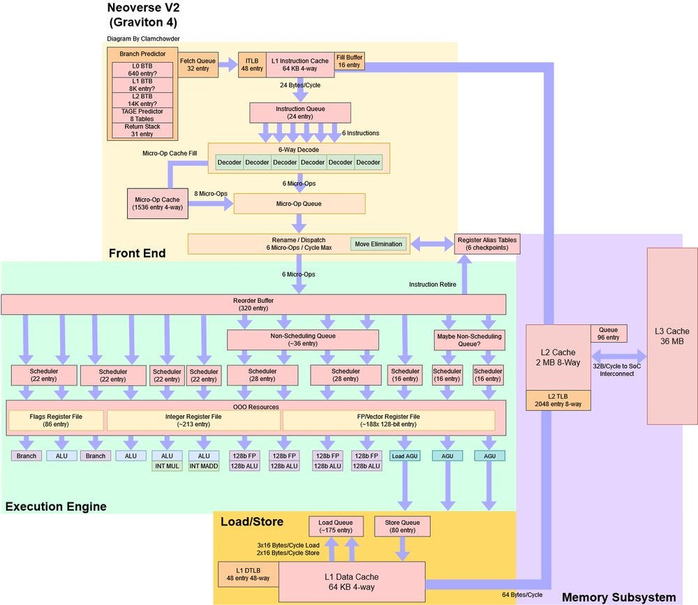

# Задание 1. Конвейер

## Пункт 1

Найдём напряжение в предположении, что оно линейно зависит от частоты

$$U(f) = Af + B$$

$$\begin{cases}
    1.2 = A + B \\
    2 = 1.8A + B
\end{cases}
\iff
\begin{cases}
    0.8 = 0.8A \\
    1.2 = A + B
\end{cases}
\iff
\begin{cases}
    A = 1 \\
    B = 0.2
\end{cases}$$

Таким образом, $U(f) = f + 0.2$, $f \geq f_{\text{min}}$.
Поскольку $U_{\text{min}} = 1$, то $f_{\text{min}} = 0.8$. При $f < f_{\text{min}}$
$U = U_{\text{min}}$. Таким образом, окончательно имеем:

$$
\boxed{U(f) =
\begin{cases}
    f + 0.2,\ f \geq 0.8 \\
    1,\ f < 0.8
\end{cases}}
$$

Далее, получим формулы для производительности и энергопотребления:

$$\text{Perf}(f) = \text{IPC} \cdot f$$

$$\text{Power}(f) = C \cdot U^2 \cdot f\text{ (пренебрежём утечкой)}$$

Теперь получим выражение для $\text{Power}(\text{Perf})$:

При $f \geq f_{\text{min}}$: $$\text{Power} = C \cdot (f + 0.2)^2 \cdot f = C \cdot \left(\frac{\text{Perf}}{IPC} + 0.2\right)^2 \cdot \frac{\text{Perf}}{IPC}$$

При $f < f_{\text{min}}$:
$$\text{Power}(f) = C \cdot f$$

Окончательно:

$$\boxed{\text{Power}(\text{Perf}) =
\begin{cases}
    C \cdot \left(\frac{\text{Perf}}{IPC} + 0.2\right)^2 \cdot \frac{\text{Perf}}{IPC},\
        \text{Perf} \geq 0.8 \cdot IPC \\
    C \cdot \frac{\text{Perf}}{IPC},\ \text{Perf} < 0.8 \cdot IPC
\end{cases}}$$

Для данных ядер:

|     | Performance | Efficient |
| :-: | :---------: | :-------: |
| IPC | 2           | 1         |
|  C  | 4           | 1         |

Итак, получаем:

$$
\boxed{\text{Power}_{\text{perf}}(\text{Perf}) =
\begin{cases}
    2 \cdot \text{Perf} \left(\frac{\text{Perf}}{2} + 0.2\right)^2,\ \text{Perf} \geq 1.6 \\
    2 \cdot \text{Perf},\ \text{Perf} < 1.6
\end{cases}}
$$

$$
\boxed{\text{Power}_{\text{eff}}(\text{Perf}) =
\begin{cases}
    \text{Perf} \cdot \left(\text{Perf} + 0.2\right)^2,\
        \text{Perf} \geq 0.8 \\
    \text{Perf},\ \text{Perf} < 0.8
\end{cases}}
$$

Построим график полученных зависимостей:



Построим кривую, отвечающую оптимальному исполнению задач в данной гетерогенной архитектуре,
когда для задач с определённым требованием по производительности отвечает ядро с наилучшей
эффективностью:



## Пункт 2

Рассмотрим следующую функцию на языке C++:

```C++
#include <algorithm>
#include <iterator>

int arr[] = {1, 3, 5, 7};

void foo() {
    std::transform(std::begin(arr), std::end(arr), std::begin(arr),
                   [](int x) { return x * x; });
}
```

Скомпилируем под архитектуру AArch64:

```bash
aarch64-linux-gnu-g++-16 foo.cpp -S -O1
```

Уровень оптимизаций выбран небольшим, дабы код не векторизовался. Получаем следующий ассемблер:

```asm
_Z3foov:
	mov	x0, 0
	adrp	x2, .LANCHOR0
	add	x2, x2, :lo12:.LANCHOR0
.L2:
	ldr	w1, [x0, x2]
	mul	w1, w1, w1
	str	w1, [x0, x2]
	add	x0, x0, 4
	cmp	x0, 16
	bne	.L2
	ret
.LFE2830:
	.size	_Z3foov, .-_Z3foov
	.global	arr
	.data
	.align	3
	.set	.LANCHOR0,. + 0
	.type	arr, %object
	.size	arr, 16
arr:
	.word	1
	.word	3
	.word	5
	.word	7
```

Дополнительные предположения:

- Исполнение `adrp` занимает 2 такта (E1 и E2);

- Запись инструкцией `cmp` в регистр флагов с точки зрения разрешения зависимостей аналогична записи
в любой GPR остальными инструкциями.

Полученный конвейер шириной 2:

$$\text{IPC} = \frac{28}{30} = 0.9(3)$$



Полученный конвейер шириной 4:

$$\text{IPC} = \frac{28}{26} = 1.(076923)$$



Прирост производительности (IPC) составляет $15.(384615)\%$.

## Пункт 3

В данной пункте модель ядра neoverse_v2 из фреймворка gem5 была модифицирована таким образом, что
вместо 9 раздельных instruction queue используется единая монолитная очередь. Производительность
ядра с исходной и модифицированной конфигурациями была замерена на наборе тестов gapbs. Результаты
представлены в виде таблицы:



Видно, что производительность снизилась на 14-20%. Полученный результат легко объяснить.



Если посмотреть на устройство neoverse_v2, то можно заметить, что различные очереди работают
параллельно и могут обращаться к разным регистровым файлам. Очевидно, что слияние очередей уменьшает
потенциал к распареллеливанию операций, обращающихся к несвязанным данным.
