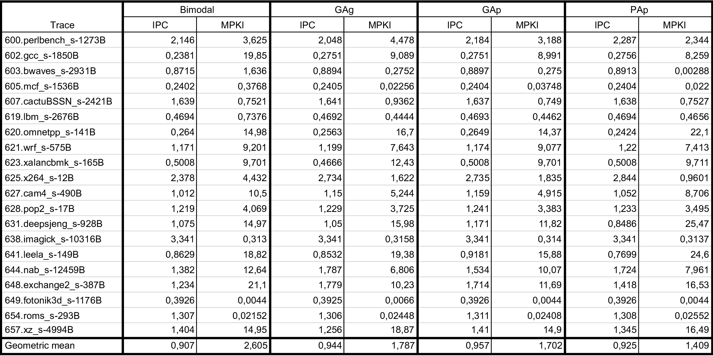
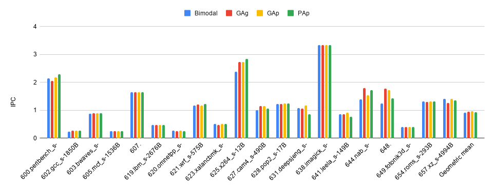
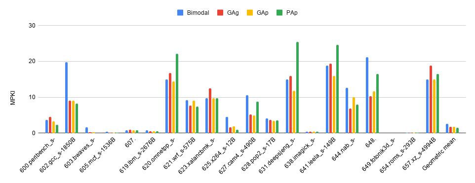

# Задание 2. Предсказатель переходов

В рамках симулятора ChampSim были реализованы 3 предсказателя переходов
[GAg, GAp, PAp](https://dl.acm.org/doi/pdf/10.1145/123465.123475).

Для GAg был взят branch history register на 14 битов, чтобы число бимодальных предсказателей
оказалось таким же, как в модели bimodal из ChampSim. Далее, для GAp и PAp branch history register
имеет размер в 2 раза меньше, то есть 7 битов. При этом, однако, используется не одна pattern
history table, а $2^7$. Суммарное число бимодальных предсказателей поэтому остаётся таким же, как в
GAg.

Симулятор, сконфигурированный с каждым из предсказателей, запускался на 20 трассах из набора SPEC
CPU 2017, использовавшихся в DPC-3. В качестве метрик производительности рассматривались IPC
(instructions per cycle) и MPKI (misses per kilo instructions).

Результаты измерений представлены в виде таблицы и столбчатой диаграммы. Для интегральной оценки
результата также приведены значения геометрического среднего для обеих метрик.

Из представленных данных можно сделать следующие выводы:

- Предсказатель GAp показывает лучший результат по IPC и второй по MPKI.

- PAp хоть и в среднем опережает GAp по метрике MPKI, но в тех случаях, когда проигрывает,
проигрывает значительно. К тому же выигрыш в среднем вызван исключительно уменьшением MPKI на 2
порядка на трассе 603.bwaves_s-2931B: если для неё подправить MPKI так, чтобы значение было близко
к такому же для GAp, среднее геометрическое окажется на стороне GAp.

- Переход GAg -> GAp (то есть дифференциация pattern history table по PC) даёт выигрыш по обеим
метрикам, а переход GAp -> PAp (то есть вдобавок дифференциация branch history register по PC)
скорее приводит к пессимизации. Полагаю, это обусловлено тем, в PAp отсутствует глобальная
история, вследствие чего некоторые переходы предсказываются хуже.

Таким образом, результаты в целом совпали в ожиданиями.
