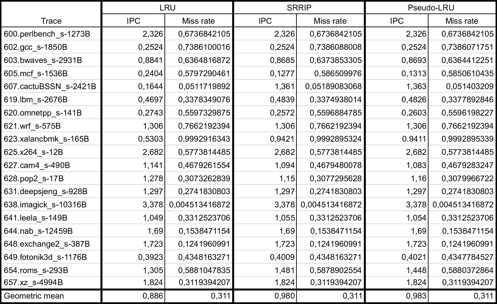
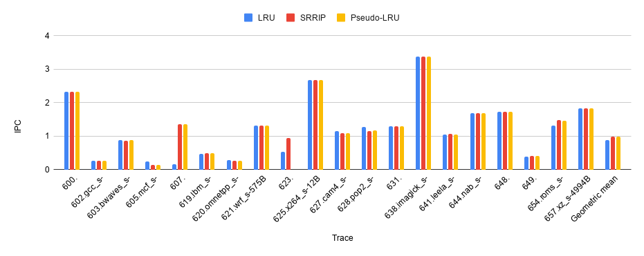
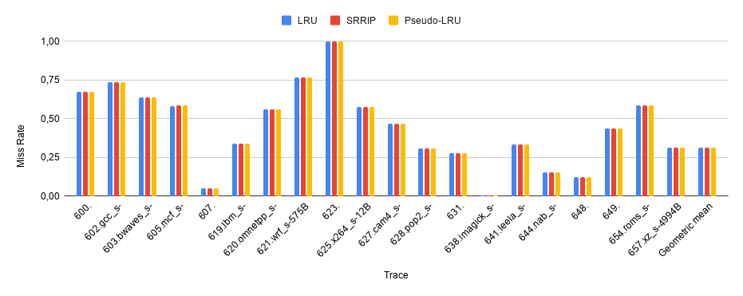

# Задание 3. Политики замещения

В рамках симулятора ChampSim была реализована политика замещения кэша Pseudo-LRU.

Симулятор, сконфигурированный с ней, а также с политиками LRU и SRRIP, запускался на 20 трассах из
набора SPEC CPU 2017, использовавшихся в DPC-3. В качестве метрик производительности рассматривались
IPC (instructions per cycle) и miss rate.

Результаты измерений представлены в виде таблицы и столбчатой диаграммы. Для интегральной оценки
результата также приведены значения геометрического среднего для обеих метрик.

У меня нет ни малейшего представления, по какой причине, во-первых, miss rate в среднем остаётся
неизменным, во-вторых, между политиками меняется IPC.
